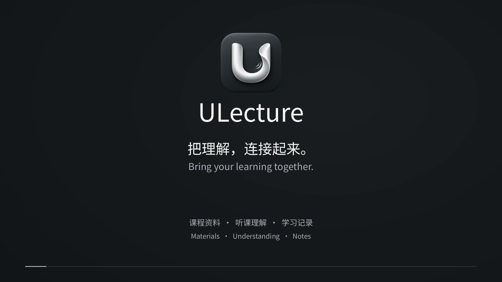
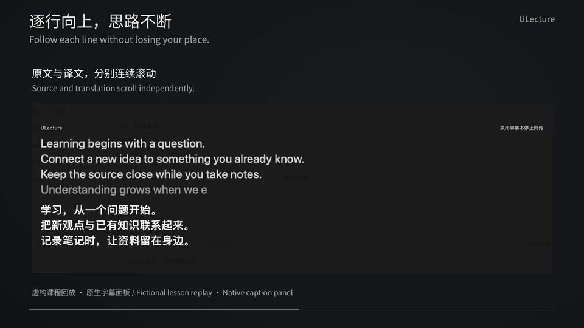
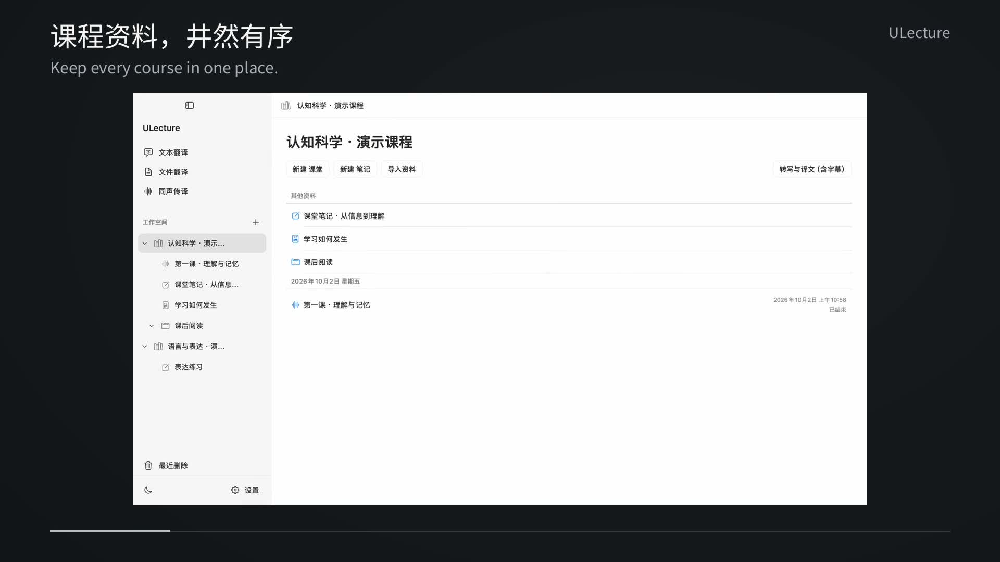
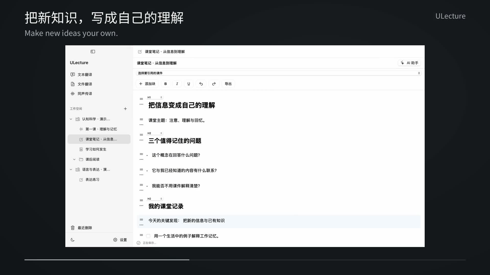

# ULecture

Connect course materials, listening comprehension, and study notes in a native macOS workspace.

Organize courses, read and annotate documents, take notes, and use live transcription, translation, and an AI study assistant. The interface supports English, Simplified Chinese, Traditional Chinese, and Japanese, with light and dark themes.

[Download](https://github.com/yqia03/ulecture/releases/latest) · [中文说明](README.md) · [User guide](docs/ulecture/user-guide.md) · [Report an issue](https://github.com/yqia03/ulecture/issues)

The introduction has original instrumental music and Chinese/English subtitles, with no narration, singing, or humming. It shows real application interaction and continuous caption scrolling using fictional course material. [Music, subtitles, and reproducible media project](media/README.md).

## Features

- **Courses and materials:** import PDF, PPT/PPTX, Markdown, and TXT; create folders and notes. The app manages course locations and only lists registered material.
- **Reading and notes:** annotate and export PDFs; write block notes with text, lists, tables, images, and version history. Slides are converted locally into a static reading PDF while the original is retained.
- **Classroom and independent interpretation:** local recognition with online text translation, plus Google and OpenAI online interpretation. Captions scroll by actual visual lines, with separate source/translation limits, ordering, font sizes, colors, and opacity.
- **Two automatic TXT files:** every session maintains source-only `transcript.txt` and source-plus-translation `transcript-bilingual.txt`, with separate Finder actions.
- **Study assistance:** ask questions about selected material, explain selections, and generate notes or summaries with saved sources and versions.
- **Local data management:** recoverable deletion, exports, storage relocation, and backup/restore. No ULecture account, cloud sync, or subscription.

## A closer look

## Requirements and installation

The build targets **Apple Silicon and macOS 14 or later**. Intel is outside the current distribution scope. [Validation scope](VALIDATION.md) lists the hardware and system actually tested; macOS 14 and M1/8 GB are not claimed as physically tested.

1. Download the ZIP or DMG from the [Release page](https://github.com/yqia03/ulecture/releases/latest) and verify it against the accompanying SHA-256 file.
2. Move `ULecture.app` into Applications and open it.
3. This distribution has an ad-hoc signature and **no Developer ID signature or Apple notarization**. macOS may block the first launch. After verifying the source and checksum, follow [Apple's supported Privacy & Security “Open Anyway” flow](https://support.apple.com/en-us/102445), or build from source. Do not disable system security.
4. Prepare the local models before local transcription. Microphone or screen/system-audio permissions are requested when you start the selected capture source. Launching the app does not start capture.

The download includes offline recognition models and local document conversion runtimes, so it is large. Local reading, notes, and transcription do not require a cloud key. Translation and AI features need your own provider account and may incur fees.

## Initial setup and providers

Settings separates AI, text translation, and document translation services. Providers include Google Gemini AI Studio, DeepSeek, OpenAI, and OpenAI-compatible endpoints. Compatible endpoints also require a Base URL. You can explicitly choose to share the AI service configuration with text or document translation.

Keys are stored in macOS Keychain. Saving or switching settings does not automatically send a test request; the Test action does. Online interpretation uses the corresponding Google/OpenAI real-time service. Model access, region, account eligibility, and fees depend on the provider. A provider's Preview label remains visible.

Local recognition primarily targets English and Japanese lessons. Noise, accents, specialized vocabulary, and overlapping speakers affect results. AI output may contain errors; check it against the original material. Offline transcription does not mean offline translation. Online interpretation sends the selected audio source to the provider.

## TXT files, captions, and storage

- Both UTF-8 TXT files come from the same saved session snapshot. Source text remains available while translation is pending; a translation is added only to its correct source revision. Revisions replace existing content without repeatedly appending duplicates.
- Online source and translation streams without reliable alignment remain independent tracks in their actual order. The app does not invent sentence pairs. Incomplete or interrupted sections receive brief status markers.
- Files update automatically. If either file cannot be published, the app reports incomplete saving and retains recovery information for retry or restart.
- Caption limits count visual lines at the current width and font size. Adding one line to a four-line window removes only the top line. Source and translation wrap independently.
- Sessions default to `~/Documents/ULecture/Transcripts`; Settings shows the actual location. Course and index data live under `~/Library/Application Support/ULecture`. Model caches retain the legacy compatibility path described in the [data guide](docs/ulecture/user-guide.md).
- Migration preserves the original legacy bilingual TXT before conversion. An unreadable database will not cause an old file to be overwritten with empty content. Create a backup before upgrading.

[Privacy and network behavior](PRIVACY.md) · [Document conversion limitations](app/docs/CONVERSION.md)

## Development, licensing, and support

Use Xcode command-line tools and the locked project dependencies. See [BUILDING.md](BUILDING.md) for bootstrap, build, and validation commands. Source, tests, build scripts, and resource locks belong in Git; models, runtimes, large builds, and private data do not.

Original ULecture source is licensed under **AGPL-3.0-only**; see [LICENSE](LICENSE). Third-party components, weights, fonts, and media retain their respective licenses. [Third-party notices](THIRD_PARTY_NOTICES.md) explain their provenance. The matching Release includes corresponding source archives and build manifests.

[Changes](CHANGELOG.md) · [Validation scope](VALIDATION.md) · [Media project](media/README.md)

When [reporting an issue](https://github.com/yqia03/ulecture/issues), include the app version, macOS version, steps, and error message. Do not submit API keys, real course material, recordings, transcripts, personal paths, or unredacted logs.
